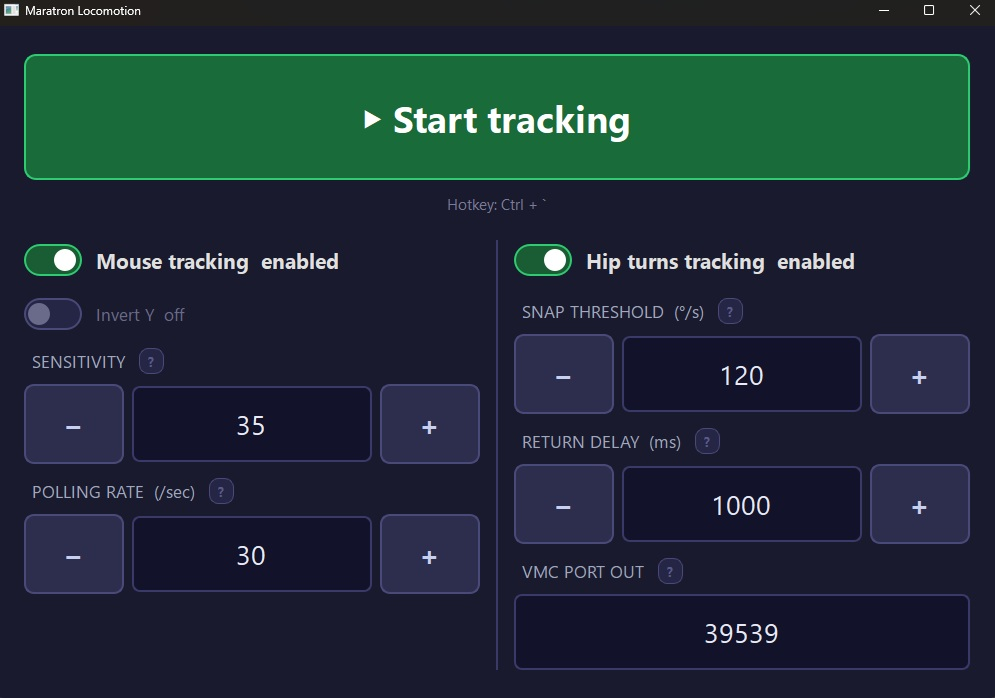
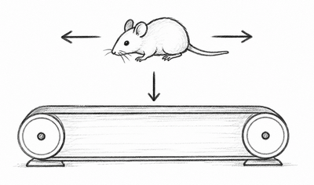
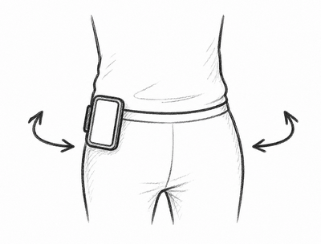

# Maratron Locomotion

Two features for [Maratron](https://www.youtube.com/watch?v=EzYy1MZocXU) in PCVR:

- **Mouse tracking** — reads Y-axis movement from a mouse mounted on your treadmill belt and drives the **left joystick** (walk forward/backward in-game). 
- **Hip snap turns** — uses an Android phone on your hip as an IMU tracker (via owoTrack + SlimeVR) and drives the **right joystick** to fire snap turns when you twist your hips.

Originally forked from [Fer Sler's project](https://github.com/fer-sler/VR-Treadmill).



---

## Requirements

* Windows, SteamVR
* Python 3 and the following packages:

```
pip install pynput vgamepad PyQt6 python-osc
```

`vgamepad` will prompt you to install [ViGEmBus](https://github.com/nefarius/ViGEmBus/releases) if needed — a Windows driver that creates virtual Xbox/DS4 controllers the OS treats as real hardware.

---

# Mouse Tracking (Walking)

Mount a gaming mouse (ideally high DPI) on or under the treadmill belt so it reads belt movement.



## One-time Setup

**Configure controller bindings in SteamVR**  
Go to **Settings → Controllers → Manage Controller Bindings → Your Game**, select **Gamepad**, and edit the bindings.

*Example — Half-Life 2: VR Mod:*

| Thumbstick | Use as | Variable | Value |
|---|---|---|---|
| Left | Joystick | Position | Move |

## Per-session

**1. Start Virtual Desktop**  
Launch Virtual Desktop on your PC and in your headset. Connect as normal.

**2. Run the script**

```
python treadmill.py
```

This registers a virtual Xbox 360 gamepad. The Maratron Locomotion window opens.

**3. Click ▶ Start tracking**  
*(can also be done after SteamVR is running)*

**4. Start SteamVR**  
Check that the virtual gamepad appears as a connected controller icon in the SteamVR window.

**5. Start your game**


---

# Hip Snap Turns (Optional)

Uses a phone on your hip as an IMU tracker. A fast hip twist fires a snap turn in-game via the right joystick.



## Requirements

* Android phone with [owoTrack](https://play.google.com/store/apps/details?id=org.owoTrack.app) app installed
* [SlimeVR Server](https://github.com/SlimeVR/SlimeVR-Server/releases) installed on desktop

## One-time Setup

1. In SlimeVR Server, assign the phone tracker to the **Hip** slot.
2. Go to **SlimeVR Settings → OSC/VMC**, enable **VMC output**, and set **Port Out** to match the **VMC Port Out** value in Maratron Locomotion (default: **39539**).
3. Add right joystick snap turn bindings in SteamVR (**Settings → Controllers → Manage Controller Bindings → Your Game**, select **Gamepad**):

*Example — Half-Life 2: VR Mod:*

| Thumbstick | Use as | Variable | Value |
|---|---|---|---|
| Right | D-Pad | Mode | Touch |
| Right | D-Pad | East | Turn Right |
| Right | D-Pad | West | Turn Left |

## Per-session Usage

1. Start SlimeVR Server and connect your phone via owoTrack.
2. In Maratron Locomotion, toggle **Hip turns tracking** on.
3. Click **▶ Start tracking**.

The app listens for VMC/OSC data on the configured UDP port. Once data arrives you'll see `[Hip] Connected` in the console.

A fast clockwise hip twist fires **snap turn right**; anti-clockwise fires **snap turn left**.

---

## Troubleshooting

**SteamVR stops seeing the virtual gamepad mid-session**  
Close SteamVR and Steam, then relaunch the chain.

---

## License

MIT